# Meta Business Partner Request Phishing Investigation

**Date:** 17 May 2026  
**Investigator:** Rayza  
**Investigation type:** Phishing / Meta Business impersonation / platform abuse  
**Status:** Investigated and prepared for abuse reporting

---

## Executive Summary

This investigation began with an email that appeared to come from Facebook/Meta, claiming that I had received a **Business Manager partner request**.

At first glance it looked suspicious because the wording was poor and the message included an `m.me` Messenger link. However, header analysis showed that the email itself was not simply a spoofed message. It passed SPF, DKIM and DMARC checks for `business.facebook.com`, and contained internal Meta notification headers for a Business Manager partner request.

The suspicious part was not the sender infrastructure. The suspicious part was the way the request appeared to use attacker-controlled content inside a legitimate Meta-generated notification to push the recipient into a Messenger flow.

The observed chain was:

```text
Legitimate Meta-generated Business Manager partner request email
→ suspicious requester-controlled text containing an m.me link
→ Messenger bot/page flow
→ fchat.vn click tracking / chatbot automation
→ shorten.as wrapper page
→ iframe to atelieralmond.com
→ fake Meta Business Partner website on autopia-vente.com
→ visitor IP/location lookup via ipinfo.io
→ credential and victim data exfiltration to api.ethnik-r.com/api/tele-send
```

The phishing site was more polished than a basic cloned login page. It presented a full fake Meta Business Partner programme website, included videos and Meta-themed marketing content, collected name/email/phone details, requested a password, displayed fake “Password is incorrect” messages, and contained logic for further final-code or 2FA-style collection.

The frontend JavaScript also contained Vietnamese-language developer comments relating to IPInfo usage, phone-number handling, password-field reset behaviour, session handling and non-blocking exfiltration calls. These comments are useful tooling artefacts, but they are not enough on their own to prove actor nationality or location.

---

## Key Findings

- The email passed SPF, DKIM and DMARC checks for `business.facebook.com`.
- Meta-specific headers identified it as a Business Manager partner request notification.
- The suspicious `m.me` link appeared inside the request/body text rather than as the main Meta CTA button.
- The legitimate button in the email pointed to a real `business.facebook.com/settings/partners/...` URL.
- The Messenger flow used `fchat.vn`, a Vietnamese chatbot/click-tracking platform, before sending the user to the phishing landing URL.
- The phishing landing chain used `shorten.as/PartnerAgencyProgram` as a wrapper.
- `shorten.as` embedded `atelieralmond.com` inside a full-page iframe.
- Direct access to `atelieralmond.com` returned `HTTP/2 403` with Cloudflare headers during collection.
- The fake Meta Business Partner website was hosted from `autopia-vente.com`.
- The frontend JavaScript set `window.API_BASE` to `https://api.ethnik-r.com`.
- Submitted victim data was sent to `https://api.ethnik-r.com/api/tele-send`.
- The site collected visitor IP/location data using `ipinfo.io`.
- The phishing kit displayed fake password failure messages, likely to harvest multiple password attempts.
- The frontend included Vietnamese-language developer comments.
- The `autopia-vente.com` HTML contained HTTrack mirror comments referencing `credit-program-partners.com`, suggesting a copied/staged deployment.

---

## Initial Observation

The email claimed I had received a Meta Business Manager partner request.

The visible message contained several suspicious elements:

```text
Meta Partner Support m.me/partnerplatformprogramagency
you is not part of or affiliated with Meta
MetaForBusiness: please complete the process at the link above
```

The grammar was a major red flag, especially:

```text
you is not part of or affiliated with Meta
```

The message also attempted to create trust by using Meta branding and the normal language of partner requests and Business Manager access.

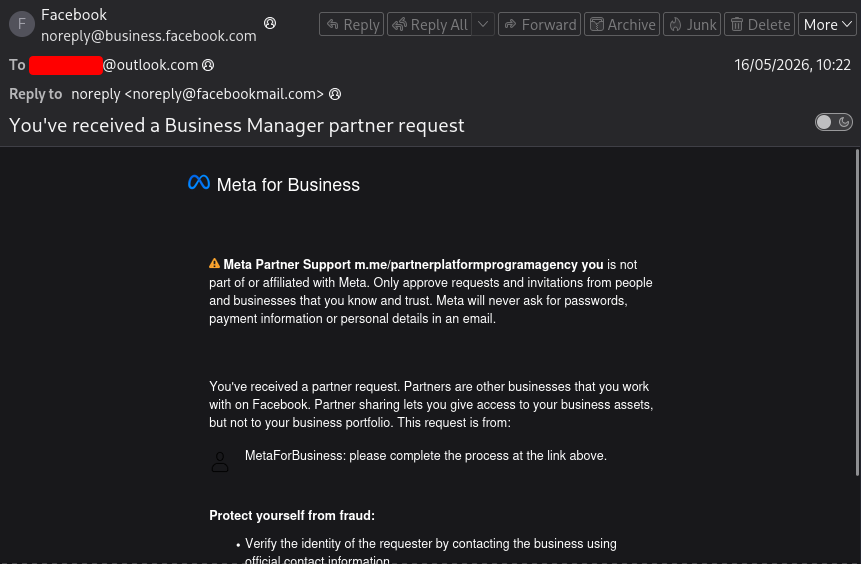

---

## Email Authentication

I exported the email as `.eml` and inspected the headers in the terminal.

The important result was that the email authentication passed:

```text
spf=pass
dkim=pass
dmarc=pass
smtp.mailfrom=business.facebook.com
header.d=business.facebook.com
header.from=business.facebook.com
compauth=pass
```

The message also included:

```text
Return-Path: noreply@business.facebook.com
From: Facebook <noreply@business.facebook.com>
X-Sender-IP: 69.171.232.146
X-SID-Result: PASS
```

Most importantly, it contained Meta-specific notification headers:

```text
X-Facebook-Notify: business_manager_partner_request_unreg
X-FB-Internal-Notiftype: business_manager_partner_request_unreg
Feedback-ID: business_manager_partner_request_unreg:Facebook
```

This changed the assessment.

The email did not appear to be a simple spoofed Facebook email. It appeared to be a genuine Meta-generated Business Manager notification that had been abused by the requester.

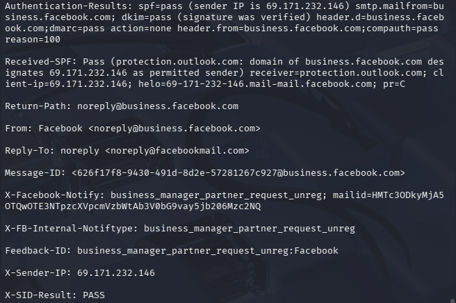

---

## Suspicious Request Text

The suspicious `m.me` link appeared inside the body/request text:

```text
Meta Partner Support m.me/partnerplatformprogramagency
```

The same section included the poor grammar and suspicious request wording:

```text
you is not part of or affiliated with Meta
This request is from: MetaForBusiness: please complete the process at the link above
```

This matters because it suggests the attacker used a requester-controlled name or message field to insert a Messenger link into a legitimate Meta-generated notification.

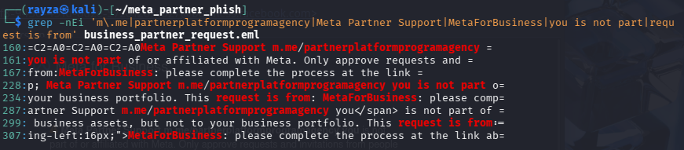

---

## Legitimate Meta Button URL

The email also contained a genuine Meta Business Suite button URL:

```text
https://business.facebook.com/settings/partners/2100993860466271/?business_id=2054282342129414
```

This was wrapped by Microsoft Safe Links in the received email, but the original source still pointed to `business.facebook.com`.

That means the email contained two different elements:

1. A legitimate Meta Business Suite partner request button.
2. Suspicious requester-controlled text pushing the victim toward `m.me/partnerplatformprogramagency`.

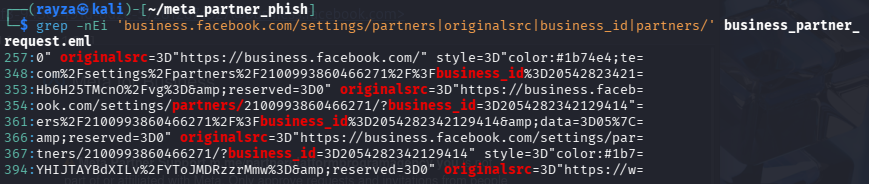

---

## Messenger Redirect Chain

The `m.me` link redirected into Messenger:

```text
hxxp://m[.]me/partnerplatformprogramagency
→ hxxps://m[.]me/partnerplatformprogramagency
→ hxxps://www[.]messenger[.]com/login/...
```

This confirmed that the text link was not a normal Meta Business approval URL. It was pushing the user into Messenger.

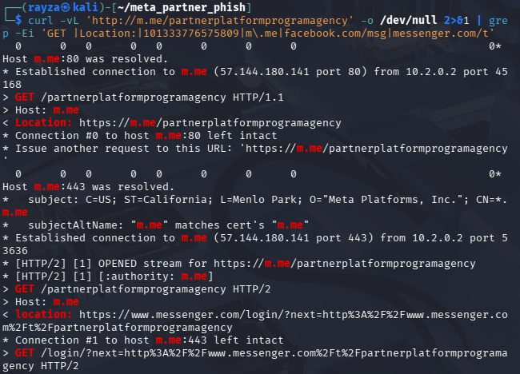

---

## Messenger Flow

The Messenger page presented a bot-style flow.

The first visible stage showed a **Get Started** button.

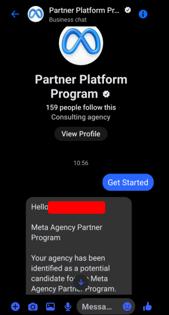

After clicking through, the bot presented options including:

```text
Program Information
Confirm Now
```

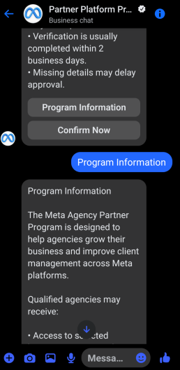

The **Confirm Now** button was the important action.

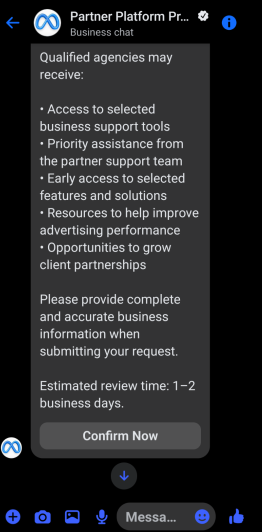

---

## Fchat Click Tracking / Chatbot Automation

Burp showed that clicking the Messenger button generated a request to `fchat.vn`:

```text
hxxps://fchat[.]vn/click?button_id=button0&...
```

The request included:

```text
page_id=101333776575809
url=https%3A%2F%2Fshorten.as%2FPartnerAgencyProgram
Referer: https://www.facebook.com/
```

This indicates that the Messenger button flow used `fchat.vn` as a chatbot/click-tracking layer before redirecting to the phishing landing URL.

`fchat.vn` appears to be a Vietnamese chatbot automation platform. This is relevant as a tooling/infrastructure artefact, especially when considered alongside the Vietnamese-language comments later found in the phishing JavaScript. However, this does not prove the operator’s identity or location.

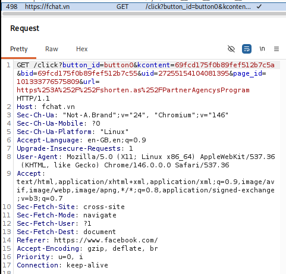

---

## Landing URL and Wrapper Page

The button eventually led to:

```text
hxxps://shorten[.]as/PartnerAgencyProgram
```

In the browser, this displayed a polished fake Meta Business Partner landing page while the address bar remained on `shorten.as`.

Burp confirmed the external landing chain.


The visible landing page presented itself as:

```text
Become a Meta Business Partner
```


---

## Shorten.as Iframe Behaviour

Inspection of the `shorten.as` HTML showed that it was not serving the full phishing site directly. It was acting as a wrapper page.

The source contained a full-page iframe:

```html
<iframe ... src="https://atelieralmond.com" ...>
```

This means the visible `shorten.as` landing URL was embedding another domain in the background.

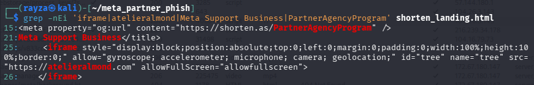

---

## Atelieralmond Direct Access

Direct access to:

```text
hxxps://atelieralmond[.]com
```

returned:

```text
HTTP/2 403
server: cloudflare
x-frame-options: SAMEORIGIN
```

This suggests `atelieralmond.com` was part of the landing chain, but did not behave like a normal standalone website when requested directly.

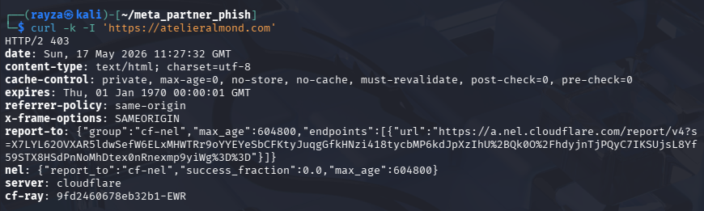

During later follow-up after reporting, the domain also triggered a Google Safe Browsing deceptive-site warning. I have not used that as part of the original attack-chain evidence because it occurred after initial collection and reporting activity.

---

## Fake Meta Business Partner Website

The phishing frontend itself was served from:

```text
hxxps://autopia-vente[.]com
```

The page was more professional than a basic credential phishing page. It used Meta branding, Meta-themed layout, videos, business language and a multi-step form flow.

The HTML title was:

```text
Become a Meta Business Partner specialising in Facebook, Instagram and Messenger
```

The page included references to Meta, Facebook, Instagram, Messenger and business advertising themes.

It also loaded assets such as:

```text
images/meta/logo-meta.svg
images/meta/streetwear.webp
images/meta/shopify.webp
videos/hero.mp4
videos/ads_manager.mp4
videos/shopify.mp4
videos/support.mp4
```

This gave the site a much more convincing appearance than many low-effort phishing pages.


---

## HTTrack Mirror Artefact

The `autopia-vente.com` landing page contained HTTrack mirror comments:

```html
<!-- Mirrored from credit-program-partners.com/ by HTTrack Website Copier/3.x [XR&CO'2014], Sat, 02 May 2026 15:53:51 GMT -->
```

A similar comment also appeared near the end of the HTML.

This suggests the phishing frontend on `autopia-vente.com` may have been copied from another deployment, staging domain or previous campaign domain:

```text
hxxps://credit-program-partners[.]com/
```

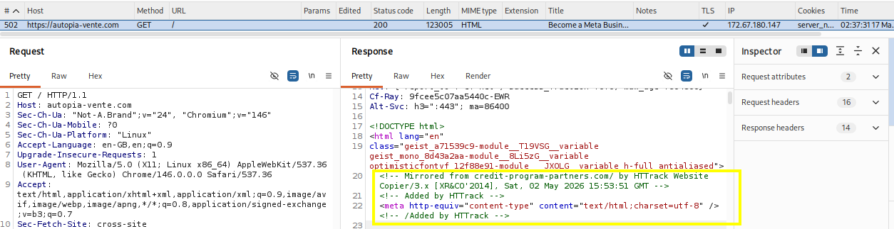

A passive check showed that `credit-program-partners.com` no longer resolved at the time of follow-up checking. WHOIS data showed:

```text
Domain: credit-program-partners.com
Creation Date: 2026-04-30
Updated Date: 2026-05-04
Registrar: Ultahost, Inc.
Nameservers: piers.ns.cloudflare.com / rosa.ns.cloudflare.com
Status during follow-up: did not resolve
```

This domain is therefore treated as a historical/source/staging lead, not as a confirmed active part of the observed delivery chain.

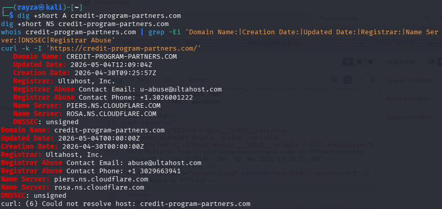

---

## Registration Form

The fake site displayed a registration form collecting:

```text
Name
Email
Phone
```

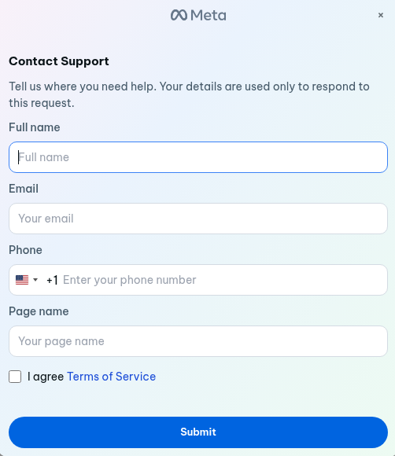

After submitting dummy data, the site moved to a password verification step.

The password prompt claimed to verify the account or process, but the behaviour observed in Burp showed submitted credentials being sent to an external API endpoint.

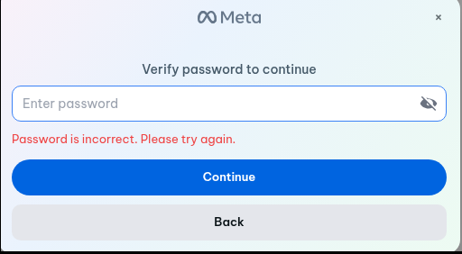

---

## Visitor IP and Location Collection

Burp captured a request to:

```text
hxxps://ipinfo[.]io/json
```

The response returned visitor IP and location data.

The JavaScript later confirmed that IPInfo collection was built into the phishing frontend.

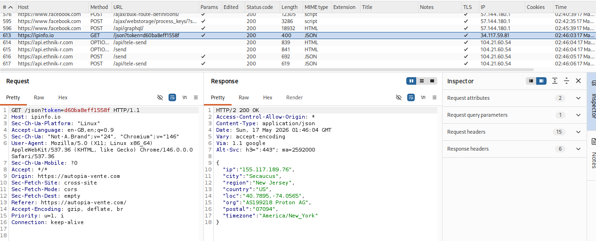

---

## Credential and Data Exfiltration

Burp captured repeated requests to:

```text
hxxps://api[.]ethnik-r[.]com/api/tele-send
```

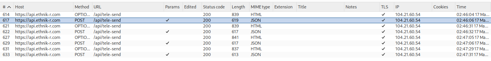

The request body contained submitted victim data in clear text.

Fields included:

```text
IP
Country
Name
Email
Phone
Pass
page_mode
```

The request originated from:

```text
Origin: https://autopia-vente.com
```

This was the key proof that the page was exfiltrating submitted data to a third-party backend.

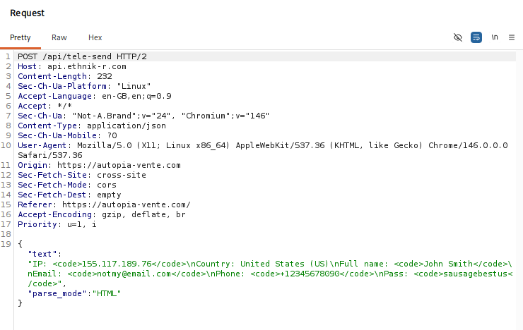

---

## JavaScript Analysis

### API Base Configuration

The phishing site loaded:

```text
config.js?t
```

This contained:

```javascript
window.API_BASE = "https://api.ethnik-r.com";
```

This directly links the fake Meta frontend to the backend API domain.

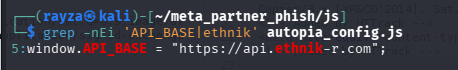

---

### IPInfo Usage

The file:

```text
root-visitor.js
```

contained logic for visitor IP/location collection.

It referenced:

```text
https://ipinfo.io/json
IPINFO_TOKEN
getIpInfo()
```

The comments in the JavaScript also showed that the developer understood IPInfo request limits and token usage.

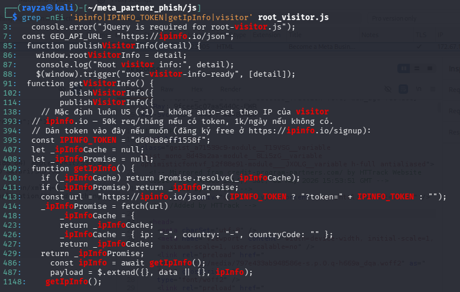

---

### Exfiltration Function

The same JavaScript contained repeated references to:

```text
sendMessTele(data)
```

and built the exfiltration URL using:

```javascript
apiBase + "/api/tele-send"
```

Since `apiBase` was set to `https://api.ethnik-r.com`, this confirms the frontend was designed to send collected data to:

```text
hxxps://api[.]ethnik-r[.]com/api/tele-send
```

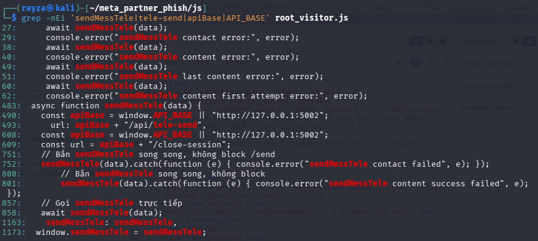

---

### Fake Password Retry Behaviour

The JavaScript contained logic and text for password retry behaviour:

```text
Password is incorrect. Please try again.
```

It also referenced:

```text
content_submit_first_attempt_failed
wrong_password
```

This matches the observed behaviour during testing: after submitting a fake password, the site returned an incorrect-password message and encouraged another attempt.

This is likely designed to harvest multiple password attempts or variants from the victim.

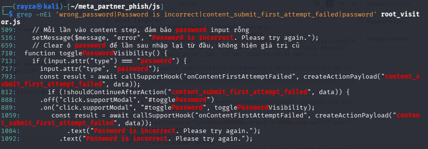

---

## Vietnamese-Language Developer Comments

The phishing JavaScript contained Vietnamese-language developer comments.

Examples included comments relating to:

```text
IPInfo token/request limits
phone-number country defaults
clearing password fields
session handling
non-blocking sendMessTele submissions
```

Translated examples:

```text
“Mặc định luôn US (+1) — không auto-set theo IP của visitor”
→ Default is always US (+1), do not auto-set based on the visitor’s IP.

“ipinfo.io — 50k req/tháng nếu có token, 1k/ngày nếu không có.”
→ ipinfo.io — 50k requests/month if there is a token, 1k/day if there is not.

“Dán token vào đây nếu muốn...”
→ Paste the token here if wanted/needed.

“Mỗi lần vào content step, đảm bảo password input rỗng”
→ Each time entering the content step, make sure the password input is empty.

“Bắn sendMessTele song song, không block”
→ Fire/send sendMessTele in parallel, do not block.
```

These comments are interesting because they appear to be developer-facing, not victim-facing.

They may suggest that the kit, or parts of it, were authored or modified by a Vietnamese-speaking developer. The use of `fchat.vn` in the Messenger flow also supports a Vietnamese-language tooling lead.

However, this is not enough to definitively attribute the operator to Vietnam. The kit may have been reused, copied, purchased or deployed by a separate actor.

A cautious assessment is:

```text
Vietnamese-language tooling artefacts: high confidence
Vietnamese-speaking kit author/modifier: moderate confidence
Vietnamese-linked tooling ecosystem: moderate confidence
Vietnam-based campaign operator: low-to-moderate confidence
```

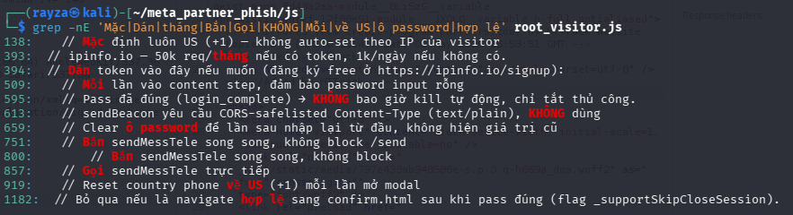

---

## Infrastructure Notes

The main observed infrastructure was:

```text
shorten.as
atelieralmond.com
autopia-vente.com
api.ethnik-r.com
ethnik-r.com
credit-program-partners.com
fchat.vn
ipinfo.io
```

The domains `autopia-vente.com`, `ethnik-r.com` and `atelieralmond.com` appeared to form the core phishing infrastructure cluster.

DNS and WHOIS checks showed:

```text
autopia-vente.com
ethnik-r.com
atelieralmond.com
```

all used:

```text
Registrar: Name.com, Inc.
Privacy: Domain Protection Services, Inc.
Nameservers: aiden.ns.cloudflare.com / raina.ns.cloudflare.com
DNSSEC: unsigned
```

Their creation dates were close together:

```text
ethnik-r.com        2026-03-26
autopia-vente.com  2026-04-01
atelieralmond.com  2026-04-06
```

This supports treating them as an operational infrastructure cluster.

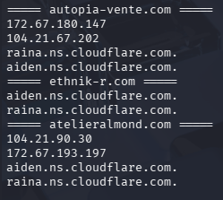

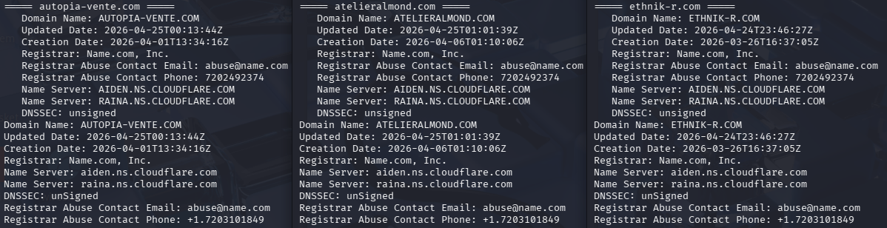

---

## Infrastructure Roles

| Domain / Service | Role |
|---|---|
| `m.me/partnerplatformprogramagency` | Messenger entry point included in suspicious request text |
| `facebook.com` / `messenger.com` | Legitimate platform used to deliver the Messenger flow |
| `fchat.vn` | Chatbot/click-tracking layer for the Messenger button |
| `shorten.as/PartnerAgencyProgram` | Public-facing wrapper URL |
| `atelieralmond.com` | Iframe destination embedded by `shorten.as`; direct access returned Cloudflare 403 |
| `autopia-vente.com` | Fake Meta Business Partner frontend |
| `api.ethnik-r.com` | Backend API configured by the phishing frontend |
| `api.ethnik-r.com/api/tele-send` | Credential/victim-data exfiltration endpoint |
| `ipinfo.io` | Visitor IP/location lookup |
| `credit-program-partners.com` | Historical/source/staging lead referenced in HTTrack comments |

---

## Indicators of Compromise

### URLs

```text
hxxp://m[.]me/partnerplatformprogramagency
hxxps://www[.]messenger[.]com/t/101333776575809/
hxxps://fchat[.]vn/click
hxxps://shorten[.]as/PartnerAgencyProgram
hxxps://atelieralmond[.]com/
hxxps://autopia-vente[.]com/
hxxps://api[.]ethnik-r[.]com/api/tele-send
hxxps://ipinfo[.]io/json
hxxps://credit-program-partners[.]com/
```

### Domains

```text
m.me
fchat.vn
shorten.as
atelieralmond.com
autopia-vente.com
ethnik-r.com
api.ethnik-r.com
ipinfo.io
credit-program-partners.com
```

### Messenger / Page Identifiers

```text
Messenger handle: partnerplatformprogramagency
Messenger/Page ID: 101333776575809
```

### Meta Notification Artefacts

```text
X-Facebook-Notify: business_manager_partner_request_unreg
X-FB-Internal-Notiftype: business_manager_partner_request_unreg
Feedback-ID: business_manager_partner_request_unreg:Facebook
```

### JavaScript Artefacts

```text
window.API_BASE = "https://api.ethnik-r.com"
sendMessTele(data)
apiBase + "/api/tele-send"
getIpInfo()
https://ipinfo.io/json
Password is incorrect. Please try again.
content_submit_first_attempt_failed
```

### Tooling / Deployment Artefacts

```text
HTTrack Website Copier/3.x
Mirrored from credit-program-partners.com
Vietnamese-language developer comments
fchat.vn Messenger click tracking
```

---

## Evidence Preservation

Collected artefacts were saved locally and hashed.

Evidence files included:

```text
atelier_landing.html
autopia_landing.html
shorten_landing.html
autopia_config.js
root_visitor.js
atelier_headers.txt
autopia_headers.txt
shorten_headers.txt
urls_from_atelier.txt
urls_from_autopia.txt
urls_from_shorten_landing.txt
whois_autopia.txt
whois_ethnik.txt
whois_atelier.txt
```

Hashing was performed using `sha256sum`.

This helps preserve the state of collected files at the time of investigation.

---

## Assessment

This campaign is best assessed as:

```text
Meta Business Manager partner-request abuse leading to Messenger-based phishing and credential theft.
```

It was not a simple spoofed email.

The more interesting part is that a legitimate Meta-generated notification appears to have been used as the initial delivery mechanism. The suspicious content was placed into the request/body text, pushing the victim into a Messenger bot flow.

The attacker then used a layered infrastructure chain:

```text
Messenger → Fchat → shorten.as → atelieralmond iframe → autopia phishing frontend → api.ethnik-r.com exfiltration
```

The fake site was professional enough to be convincing. It used Meta-style branding, marketing content, video assets, a multi-step registration form, password capture, fake password rejection and likely further code/2FA collection.

The JavaScript showed deliberate visitor profiling and exfiltration logic, including IPInfo usage, an API base configuration, repeated `sendMessTele` calls and a `/api/tele-send` backend path.

---

## Attribution Notes

There are several Vietnamese-linked artefacts:

```text
Vietnamese-language developer comments in root-visitor.js
Use of fchat.vn in the Messenger button flow
Meta/Facebook Business targeting, which overlaps with publicly reported Vietnamese-linked cybercrime activity
```

However, this is not enough to definitively attribute the campaign to a Vietnam-based actor.

The safest wording is:

```text
The phishing kit or automation workflow shows Vietnamese-language influence and may be connected to a Vietnamese-speaking tooling ecosystem. Direct actor attribution is not established.
```

This could mean:

```text
- The kit was written by a Vietnamese-speaking developer.
- The operator is Vietnamese-speaking.
- The operator reused a kit written by someone else.
- The infrastructure was purchased, copied or rented.
```

The evidence supports a Vietnamese-language tooling lead, not a confirmed identity.

---

## Impact

A victim following the flow could be exposed to:

```text
Facebook/Meta account credential theft
Business Manager compromise
Page or asset access theft
Ad account compromise
2FA/code harvesting
Phone/email collection
IP/location profiling
Follow-on fraud or extortion
```

The risk is higher than a generic fake login page because the initial email passed authentication and appeared to come from legitimate Meta infrastructure.

This makes the lure more believable to business users who know that partner requests are a real Meta feature.

---

## Abuse Reporting

Reports made to:

```text
Meta / Facebook
Cloudflare
shorten.as
Name.com
Ultahost
Netcraft
VirusTotal
```

Reports included:

```text
Messenger/Page ID: 101333776575809
m.me handle: partnerplatformprogramagency
Fchat click URL showing page_id and shorten.as destination
shorten.as/PartnerAgencyProgram
atelieralmond.com
autopia-vente.com
api.ethnik-r.com/api/tele-send
credit-program-partners.com
Screenshots of credential exfiltration request
Headers showing legitimate Meta-generated notification abuse
```

---


## Final Notes

This was a more layered campaign than a basic Meta phishing page.

The most interesting part was the abuse of a legitimate Meta Business Manager notification to move the victim into a Messenger-led flow, followed by a professional fake Meta Business Partner site and clear credential exfiltration behaviour.

The campaign showed signs of deliberate tooling, staged infrastructure, visitor profiling and possible Vietnamese-language kit development.

Direct actor attribution is not established, but the tooling and delivery chain provide a useful case study in how phishing campaigns can abuse legitimate platform features rather than relying only on spoofed email.
